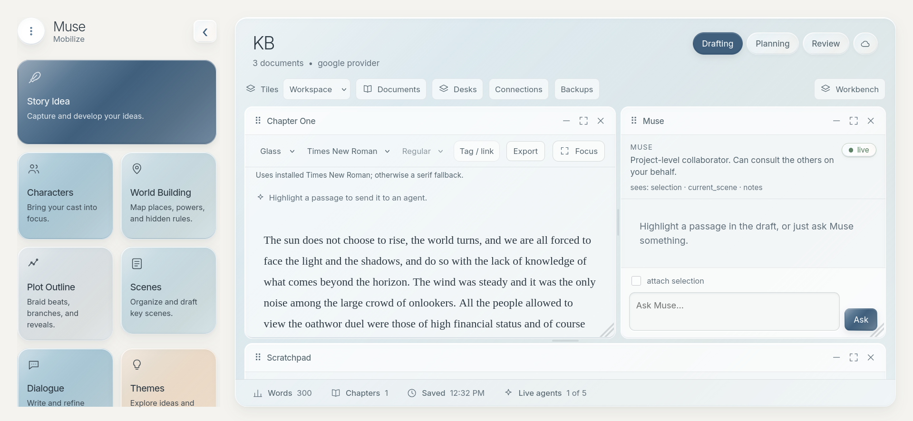
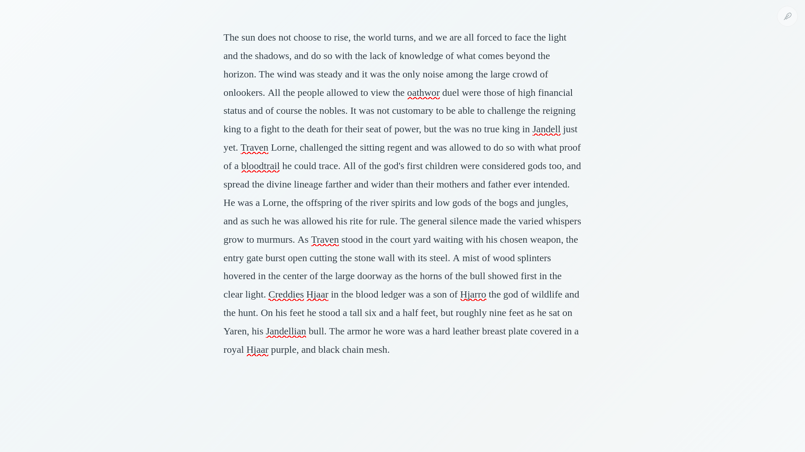
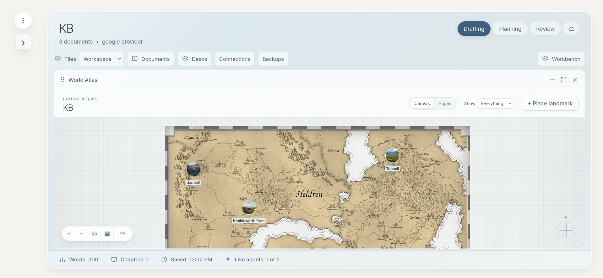
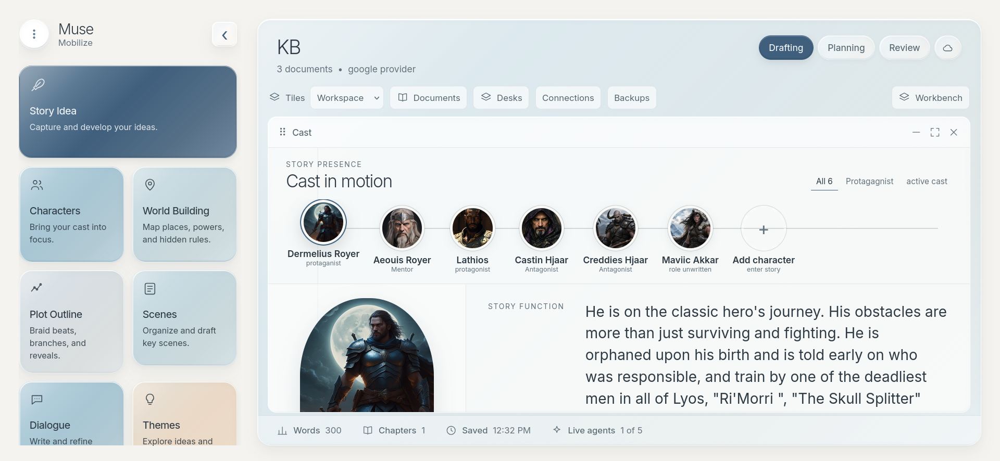

# Muse · Mobilize

> A writers' room you can assemble around the page.

A local-first, artifact-centered multi-agent creative workspace. The manuscript
is a plain Markdown file on your disk; agents orbit it and propose reviewable
patches. Nothing is written into your draft without your explicit accept.

## Screenshots

| Workspace + Muse consult | Writing focus |
|---|---|
|  |  |

| World Atlas | Characters |
|---|---|
|  |  |

## Run it

```bash
npm install
npm run dev
```

Then open **http://localhost:5177** (Vite opens it for you).

Port `5177` is frontend; `5178` is runtime API. Vite uses strict port binding so
duplicate `npm run dev` commands fail clearly instead of moving the frontend
onto the API port and creating a proxy-loop 500. If `5177` is already in use,
use the existing Muse tab, or stop the duplicate dev process before restarting.

Two processes start:

| process | port | what it is |
|---|---|---|
| `web` | 5177 | Vite + React workspace shell |
| `server` | 5178 | project runtime: filesystem, events, agents, model providers |

No API key is needed to try it. The default provider is **Mock (offline)**,
which walks the whole path — it comments on your real selection, raises a real
consultation with another agent, and proposes a real patch anchored to your text.

## Writing surface

The original blue, mist, sage, and sand palette now has an etched-glass treatment:
subtle inset edges, frosted drawers, recessed fields, and locally bundled Inter
Variable. Headings are light; manuscript text keeps a readable regular weight.
At 700px and below, tools form a horizontal rail. Drafting panes stack when the
workspace is narrow without changing the saved desktop arrangement.
Reduced-motion and transparency preferences have explicit CSS fallbacks.

See [design and responsive verification](docs/design-2026-09-05.md).

Short phone and landscape screens now scroll vertically to preserve the working
canvas. Touch devices get larger primary controls and a visible writing-focus
exit. See [mobile audit and device-testing limits](docs/mobile-audit-2026-09-12.md).
Run the touch-enabled checks with `npm run test:browser -- e2e/mobile.spec.ts`.

To test on your own phone, stop any existing `npm run dev`, run
`npm run dev:phone`, and open the terminal's **Network** URL in Safari or Chrome
on the same trusted Wi-Fi. Keep the computer running. This serves the existing
web app; Expo Go is not needed. See [phone testing steps](docs/testing-on-your-phone.md)
for setup, troubleshooting, and the hands-on checklist.

Manuscript **Focus** also offers **Hide controls** for a quiet page and optional
browser **Fullscreen**. A small feather restores controls. **Story cards** or
**Alt+Shift+K** opens editable story records above the draft; Escape dismisses
that layer before leaving writing focus. Card drafts recover locally when the
same form is reopened; save them to include their contents in project backups.
Browser fullscreen Escape is controlled by the browser.
See [quiet focus and story cards](docs/quiet-focus-and-story-cards-2026-09-06.md).

## Writing trust and connections

**Connections** ties shared tags to story records and manuscript passages.
Select text and type **`!#`**, or use **Tag / link**, to open the picker without
leaving command tokens in prose. Tags survive renames; backlinks navigate only
when their quote and context still match. Record cards remain editable in focus.

Unfinished documents and the seven card forms have browser-local recovery.
**Backups** downloads saved project files and restores them as a separate project,
never over the original. Save tool forms first: browser recovery and Saved Desks
are not portable backups. See [features, limits, and acceptance checklist](docs/writing-trust-and-connections-2026-09-06.md).

## Story repository preparation

The optional **Mobilize** skill in `skills/mobilize/` prepares an existing story
repository for Muse through a read-only mapping preview and an approved JSON
bundle. Sources remain verbatim; a provenance receipt travels with the documents.
Restore the bundle through **Backups** as a new project. Version 1 does not extract
structured lore cards or synchronize an existing project.

See [Mobilize and export roadmap](docs/mobilize-and-export-roadmap.md) for scope,
testing, and the separation between project archives and future novel/comic output.

## The golden path

1. A project is created for you on first run, seeded with a short chapter.
2. Highlight a few sentences in the centre pane.
3. The bar above the draft lights up: **Ask → Muse / Continuity / Editor / Architect / Kiala**.
4. The agent reads only its declared scope, and may consult another agent —
   you see the consultation, the question, and the reply.
5. A **Proposed revision** card appears: before, after, and the reason.
6. **Accept**, **Reject**, or **Modify** the replacement text and then accept.
7. The change lands in the draft, a snapshot is taken, and the activity log records it.
8. Keep typing. Nothing blocks.

## Using a real model

Open **Settings** (cloud icon top-right). Fast lane puts common hosted engines first:

- **OpenAI** — Responses API, default preset `gpt-5`.
- **Google Gemini** — Interactions API, default preset `gemini-3.7-flash`.
- **xAI / Grok** — Responses API, default preset `grok-4.6`.
- **Anthropic** — Messages API remains available under Local & other.
- **Ollama** — free local shelf with one-click model download and activation.

Choose an engine, use **Create key**, paste one key, choose a preset, then
**Save & check**. Checks are explicit because they send a tiny billable request.
Keys stay in `~/.muse-mobilize/settings.json` on this machine, never inside the
story folder or git, with owner-only file permissions. The server returns only
key-present flags to the browser. Hosted calls set `store: false` where the
vendor API supports it.

Developers and CI can skip paste flow with standard environment variables:

```bash
OPENAI_API_KEY=… npm run dev
GEMINI_API_KEY=… npm run dev
XAI_API_KEY=… npm run dev
```

An agent whose file says `provider: default` follows this setting. Agent
identities never change when the engine does.

### Free local fast start

Install [Ollama](https://ollama.com/download) once, then open **Settings → Free
local → Ollama**. Choose a model and press **Download & use**. Muse streams
download progress and switches default agents only after Ollama reports success.

| choice | download | fit |
|---|---:|---|
| Qwen 3.5 Tiny | 1.0 GB | fastest notes and short passes |
| Phi-4 Mini | 2.5 GB | compact structured reasoning |
| Qwen 3.5 4B | 3.4 GB | recommended drafting/agent balance |
| Muse Glimmer 30B | 18 GB | heavyweight local agent work |

Local use needs no API key and has no per-token charge. Hardware still matters:
larger models need more RAM and run slower. Advanced settings preserve custom
Ollama URLs and manually installed model names.

Adding another provider should stay small. See [Provider adapter guide](docs/providers.md).

## Your project on disk

```
~/MuseProjects/<your-story>.muse/
├── project.json
├── manuscript/chapter-01.md      ← plain Markdown, open it anywhere
├── outline/outline.md
├── notes/scratchpad.md
├── canon/
│   ├── canon.json                ← portable entities, facts, statuses, evidence
│   └── characters/
├── plot/plot.json                ← branching through-line, folios, and typed edges
├── scenes/scenes.json            ← scene lanes, story references, beats, and dialogue
├── agents/*.yml                  ← edit these to change an agent
├── workspaces/*.json
└── .muse/
    ├── events.jsonl              ← append-only creative history
    └── snapshots/                ← taken before every accepted patch
```

Edit `agents/*.yml` in any text editor and reload the browser: scope,
permissions, budgets and system prompts are all yours.

## Editing an agent

```yaml
context:
  scope: [selection, current_scene, notes]   # what it may see
communication:
  may_contact: [continuity, architect]       # who it may consult
budget:
  max_steps: 3                               # consultation rounds, enforced by the runtime
```

Permission is checked in both directions before any agent-to-agent contact, and
a refused contact is written to the event log.

## Characters workspace

Click **Characters** to bring cast workspace into focus. It is a domain surface,
not another launcher menu:

- Connected cast line for selecting active story characters.
- Focused dossier with story function, physical presence, goals, fears, and canon trail.
- Vision, Audio, and Proximity sensory bands with hierarchical indicators.
- Category filters such as `active cast`, `council`, or `protagonist`.
- Edge drawer for creating or revising character profiles with multi-image upload, drag/drop, links, captions, and cover portrait.
- Direct handoff to matching character agent or Continuity canon.

Character profile contract lives at `schemas/character-profile.schema.json`.

## World Building workspace

Click **World Building** to open the Living Atlas directly. Canvas mode is the
default domain surface instead of another launcher menu:

- Pan and zoom an open spatial field; drag landmarks to persistent positions.
- Add places, factions, objects, events, rules, and lore through an edge drawer.
- Record era, atmosphere, story significance, categories, aliases, and summary.
- Attach multiple uploaded or linked images; first image becomes landmark/page cover.
- Draw relationship threads backed by proposed canon facts.
- Use **Pages** for an editorial atlas index and open bound lore documents.
- Move focused landmarks with arrow keys; hold Shift for larger steps.

World profile contract lives at `schemas/world-profile.schema.json`.

## Plot Outline workspace

Click **Plot Outline** to open a braided story current directly. It is a
narrative-order surface rather than a card board or spatial world map:

- Arrange beat, turn, reveal, climax, and resolution knots along telling order.
- Expand manuscript strips in place or open a focused folio with goal, conflict,
  stakes, outcome, and planning notes.
- Attach multiple uploaded or linked visual references; first image marks plot beat.
- Draw typed `sequence`, `branch`, `merge`, and `cause` threads between beats.
- Give every thread its own path text and revise that text/type directly from a beat folio.
- Bind a beat to a manuscript or planning document for direct page handoff.
- Drag knots or move them with arrow keys; hold Shift for larger steps.
- Add up to three optional World Atlas anchors per beat. World pins stay hidden
  until requested; Atlas backlinks appear only on referenced landmarks.

Plot graph contract lives at `schemas/plot-graph.schema.json`.

## Scenes workspace

Click **Scenes** to open storyboard directly:

- Each scene becomes horizontal beat lane grouped by story section.
- Add, revise, and reorder small dramatic beats through scene folio.
- Drag Characters, Themes, Locations, and Plot nodes from story-material rail
  into any scene. Clicking resource adds it to selected scene for keyboard use.
- References use stable canon/plot IDs, so source names and descriptions remain
  authoritative.
- Bind scene to manuscript page, record purpose/status, and hand selected scene
  directly to Dialogue table.

## Dialogue workspace

Click **Dialogue** for script/table-read surface tied to selected scene:

- Write and reorder spoken lines by canon-backed speaker.
- Track subtext separately from audible dialogue.
- Record speaker knowledge, belief, or misunderstanding at each line.
- Mark manual voice check as `unchecked`, `in_voice`, or `review`, with note.
- Open bound manuscript draft or return to exact scene on storyboard.

Scenes and Dialogue share portable contract at `schemas/scene-board.schema.json`.

## Themes workspace

Click **Themes** to follow motif movement through manuscript order:

- Create a theme with motif, dramatic question, and working description.
- Mark each scene as `appears`, `echoes`, `fades`, or `resolves`.
- Read gaps and returns directly across scene columns instead of maintaining a
  separate planning board.

## References workspace

Click **References** for story-linked research and visual memory:

- Collect uploaded images, quotations, and web sources in one moodboard.
- Keep captions, attribution, source URLs, and private working notes together.
- Link each reference to stable Character, World, Plot, Scene, Theme, or Document
  IDs so renamed story material keeps its connection.

## Goals workspace

Click **Goals** to set current-session intent and a manuscript milestone route:

- Record one session focus plus optional word and minute targets.
- Order milestones, assign status and due date, and track optional word targets.
- Keep manual completion authoritative when a numeric target reaches its ceiling.

## Progress workspace

Click **Progress** for an editorial record derived from project truth:

- Read current manuscript words and event-derived word flow.
- See completed, active, and planned scenes without duplicating scene state.
- Revisit unresolved revision metadata from the append-only project history.

## Canon and continuity

Use **canon trail** inside Characters or World Building workspace. Plot Outline
may reference canon-backed World landmarks without copying their data.

- Create stable character, location, organization, object, event, rule, or lore entities.
- Capture facts as `idea`, `proposed`, `established`, `canonical`, `retconned`, or `deprecated`.
- Highlight manuscript text before capturing a fact to attach exact evidence.
- Promote facts explicitly; new facts default to `proposed`.
- Continuity receives status-labelled canon and privileges `established` and `canonical` facts.

Canon stays in readable JSON inside story project. Older projects need no migration;
missing `canon.json` behaves as empty canon until first entity or fact is captured.

## Tests

```bash
npm test
```

Covers canon persistence, character profiles and sensory metadata, world
profiles and canvas coordinates, branching plot persistence, scene/theme
occurrences, reference and goal stores, derived progress, managed image
validation, sparse World anchors, stable relationship edges, fact promotion,
evidence-aware context, provider request/redaction contracts, agent output
parsing, patch anchoring, and stale-patch refusal.

Browser acceptance tests use real Chromium, the frontend, and the API against a
fresh temporary project store. They do not use your projects or provider settings.

```bash
npx playwright install chromium
npm run test:browser
```

The runner owns ports 5277/5278 and removes its temporary project directory when
it exits. Keep those ports free; normal development remains on 5177/5178. Tests
cover uploads, Themes, References, Goals, and Progress, including save/reload,
failed-save retry, overlapping uploads, milestone ordering, revision recovery,
and phone-sized upload/drafting layouts. Failure traces
and screenshots appear in `test-results/`; HTML report is in `playwright-report/`.

See [acceptance results](docs/acceptance-2026-09-04.md) for tested behavior,
regressions fixed, and remaining coverage limits.

## What is not built yet

Semantic retrieval, watchers, Writers' Room orchestration, frozen readers,
version-control branches, plugins, and desktop packaging. The seams are in
place for all of them; see `muse-mobilize-handoff/MUSE_MOBILIZE_HANDOFF.md` §32.
