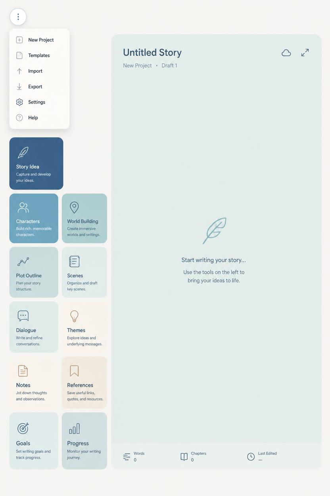

# Muse-Mobilize — Product & Architecture Handoff

**Working name:** Muse-Mobilize  
**Alternate shorthand:** MUSE: Mobilize  
**Status:** Concept / architecture lock candidate  
**Primary product idea:** A composable, artifact-centered multi-agent creative workspace for fiction and long-form writing.

---

## 1. Product Thesis

Muse-Mobilize is **not** a writing app with AI bolted onto it.

It is a **creative runtime** in which the manuscript remains the primary artifact while specialized agents, tools, references, and views can be assembled around it as needed.

The core principle is:

> **The draft is sovereign. Agents orbit the draft; the draft does not orbit the agents.**

The best short pitch is:

> **A writers' room you can assemble around the page.**

The deeper technical framing is:

> **Artifact-centered multi-agent creation.**

---

## 2. Reference Design

The current UI direction is intentionally calm, spacious, writer-first, and low-noise.



### Design qualities to preserve

- Soft, editorial visual language rather than a developer-console aesthetic.
- The manuscript/workspace should dominate visual attention.
- Left-side domain cards should behave as **launchers**, not as hard page navigation.
- Resizable panes should feel lightweight and temporary rather than like a dense IDE.
- Agent activity should be visible but subtle.
- Complexity should emerge only when the user asks for it.
- The interface should still feel usable with **one manuscript and one agent**.

### Recommended design evolution

The large central blue surface becomes the **Workspace Canvas**.

At project creation it may contain only the manuscript editor.

Opening tools or agents adds panes beside or around the manuscript:

```text
┌───────────────────────────┬───────────────┐
│                           │               │
│                           │     KIALA     │
│          DRAFT            │               │
│                           │ Character     │
│                           │ Agent         │
│                           │               │
├───────────────────────────┼───────────────┤
│          NOTES            │  CONTINUITY   │
└───────────────────────────┴───────────────┘
```

Panes can be resized, repositioned, minimized, maximized, frozen, or dismissed.

A pane is a **view**, not necessarily an agent.

---

## 3. Key Product Model

### 3.1 Project hierarchy

```text
Application
└── Project
    ├── Documents
    ├── Canon
    ├── Assets
    ├── Workspaces
    │   └── Panes
    ├── Agents
    ├── Sessions
    ├── Plugins
    ├── Snapshots
    └── Event Log
```

### 3.2 Four conceptual layers

```text
Project
│
├── Canon
│   ├── Manuscript
│   ├── Characters
│   ├── Locations
│   ├── Lore
│   ├── Timeline
│   └── Rules
│
├── Creative Workspace
│   ├── Drafting workspace
│   ├── Character workspace
│   ├── Plot workspace
│   └── Review workspace
│
├── Intelligence
│   ├── Agents
│   ├── Models
│   ├── Tools
│   └── Context
│
└── History
    ├── Sessions
    ├── Changes
    ├── Decisions
    └── Snapshots
```

- **Canon** = what is true in the story.
- **Workspace** = how the writer is currently arranging the project.
- **Intelligence** = the reasoning systems allowed to interact with the project.
- **History** = what changed and why.

---

## 4. Architectural Inspiration

Primary inspiration: **DeepSeek Harness**  
Repository: https://github.com/deepseek-ai/deepseek-harness

The key principle worth borrowing is **replaceable capability seams** rather than copying Harness's implementation.

Muse-Mobilize should treat the following as pluggable interfaces:

```text
ModelProvider
AgentRole
Tool
ContextProvider
DocumentType
PaneType
StorageProvider
SearchProvider
ExportProvider
Importer
StoryAnalyzer
```

The system should not be coupled to OpenAI, Anthropic, Gemini, DeepSeek, Ollama, LM Studio, or any one model runtime.

Models are engines.

Agents are roles.

---

## 5. Agents and Models Must Be Separate Objects

Do **not** model the system as:

```text
GPT Agent
Claude Agent
Qwen Agent
```

Instead:

```text
Continuity Agent
Character Agent
Architect Agent
Reader Agent
Editor Agent
Wild Muse Agent
Research Agent
```

Each agent references a model provider.

Conceptually:

```text
Agent = identity + responsibility + context + permissions
Model = cognitive engine
```

This allows the same Kiala agent to run on Claude today and a local Qwen model tomorrow without changing her role definition.

---

## 6. Core Agent Roles

### Muse
Project-level collaborator and optional orchestrator.

### Continuity
Conservative checker for chronology, canon, knowledge, naming, contradictions, setup/payoff, and prior facts.

### Character
Represents one character's psychology, knowledge, voice, relationships, and behavioral consistency.

### Architect
Handles scene structure, pacing, causality, reversals, reveals, chapter endings, and arc-level design.

### Editor
Handles prose, clarity, rhythm, repetition, voice, line-level craft, and patch proposals.

### Reader
Acts as a first-time audience member with an explicit knowledge cutoff.

### Wild Muse
Divergent ideation. Can be intentionally isolated from canon constraints.

### Researcher
Performs outside-world research when web access or external sources are allowed.

### Devil / Skeptic
Attempts to break logic, predict reader objections, expose weak causality, and challenge convenience.

### Director
Coordinates other agents toward a bounded objective.

---

## 7. Agent State and Activation

### State

```text
live
idle
frozen
```

- **Live**: may act according to permissions and subscriptions.
- **Idle**: retains state but does not process changes automatically.
- **Frozen**: context is locked to a defined project/story revision.

### Activation

```text
manual
on_request
watcher
```

- **manual**: responds only when directly invoked.
- **on_request**: other permitted agents may consult it.
- **watcher**: listens for specific project events.

### Authority

```text
read
suggest
patch
write
direct
```

- **read**: inspect only.
- **suggest**: offer recommendations.
- **patch**: propose structured edits.
- **write**: directly modify permitted artifacts.
- **direct**: delegate work to other agents.

Core rule:

> **Open ≠ Active ≠ Watching**

This allows effectively unlimited panes without forcing every agent to remain computationally live.

---

## 8. Recommended Window / Pane Model

### User-facing limits

- Open panes: effectively unlimited.
- Visible panes: soft warning around 8–12.
- Simultaneously active agents: default 4–8.
- Hard active-agent ceiling for early versions: ~16.
- Persistent watchers: default maximum around 3–5.
- Writers' Room participants: usually 2–6.

### Principle

> **Unlimited minds in the room. Limited people talking at once.**

### Pane types

A pane can host:

- manuscript editor
- agent conversation
- character sheet
- lore browser
- image/reference
- timeline
- plot outline
- scene board
- notes
- research
- diff viewer
- activity log
- first-reader simulation
- project graph

---

## 9. Workspace System

A project may contain many panes, but workspaces save useful arrangements.

### Drafting workspace

```text
Manuscript
Continuity
Character Agent
Notes
```

### Plot workspace

```text
Outline
Timeline
Architect
Wild Muse
```

### Character workspace

```text
Character Sheet
Character Agent
Relationship Map
Relevant Scenes
```

### Review workspace

```text
Manuscript
Reader
Editor
Continuity
```

Workspaces should save pane positions, sizes, visibility, focus, and bindings.

---

## 10. Left Sidebar Domain Cards

The current categories are strong and should remain.

Recommended behavior: each card opens a small launcher menu rather than forcing page navigation.

### Story Idea

- Idea Capture
- Muse
- Premise Builder
- Constraint Generator

### Characters

- Character Library
- Character Agent
- New Character
- Character Consistency
- Relationship Map

### World Building

- Lore Library
- Location Builder
- Faction Builder
- World Rules
- World Agent

### Plot Outline

- Outline
- Architect
- Timeline
- Setup/Payoff Tracker
- Unresolved Threads

### Scenes

- Scene Board
- Scene Draft
- Scene Diagnostics
- Scene Variants

### Dialogue

- Dialogue Editor
- Character Voice
- Conversation Simulator
- Subtext Critic

### Themes

- Theme Notes
- Motif Tracker
- Theme Critic

### Notes

- Scratchpad
- Project Notes
- Decision Log

### References

- Project Files
- Images
- Research
- Web Sources
- Lore Sources

### Goals

- Session Goal
- Chapter Goal
- Draft Milestones

### Progress

- Word Count
- Chapter Completion
- Revision Status
- Writing Sessions

### Add: Workspace

Recommended new top-level control:

```text
Workspace
  Drafting
  Planning
  Characters
  World
  Review
  Custom Workspace...
```

---

## 11. Context Engine

Context should be a first-class subsystem.

Never blindly send the whole project to every model request.

### Context hierarchy

```text
Selection
  ↓
Paragraph
  ↓
Scene
  ↓
Chapter
  ↓
Arc
  ↓
Manuscript
  ↓
Universe
```

Each agent receives an explicit scope.

Examples:

```text
Prose Editor
scope = selection + scene
```

```text
Continuity
scope = chapter + manuscript + canon
```

```text
First-Time Reader
scope = chapters 1–7 only
```

### Context providers

The engine may assemble context from:

- selected text
- current scene
- current chapter
- related character sheets
- relevant canon entities
- prior appearances
- timeline events
- recent agent conversation
- explicitly attached notes
- search/RAG results

### MVP context strategy

Start simple:

- current document
- selected text
- explicit attachments
- explicit entities
- recent session history

Add semantic retrieval later.

---

## 12. Frozen Context / Knowledge Cutoffs

Frozen agents are a major storytelling feature, not only a resource-management feature.

Example:

```yaml
agent: reader_chapter_6
state: frozen
knowledge_cutoff:
  chapter: 6
  revision: 938
```

This reader can then answer:

> Who do you currently suspect?

without knowing future reveals.

The same mechanism can model character knowledge:

```text
Kiala @ Chapter 4
Kiala @ Chapter 13
```

These can be separate context snapshots.

---

## 13. Canon System

Brainstorming should never silently become truth.

Every structured fact should have a status:

```text
idea
proposed
established
canonical
retconned
deprecated
```

Example:

```yaml
fact:
  subject: Kiala
  predicate: birthplace
  value: Veyr
  status: canonical
  evidence:
    - chapter_03
```

Versus:

```yaml
fact:
  subject: Emperor
  predicate: secretly_alive
  value: true
  status: proposed
```

Continuity agents should privilege canonical and established facts while clearly distinguishing speculation.

---

## 14. Agent-to-Agent Communication

Agents should communicate through explicit messages rather than unrestricted shared memory.

Example envelope:

```yaml
message:
  id: msg_839
  from: architect
  to: continuity
  type: consultation
  question: "Does Kiala know the imperial seal at this point?"
  attached_context:
    - scene_12
  response_required: true
```

Benefits:

- visible provenance
- reproducibility
- permissions
- cancellation
- budgeting
- inspection
- debugging

The UI can show subtle connection activity between panes.

Example:

```text
Architect ─────consult─────► Continuity
Architect ◄────response──── Continuity
```

---

## 15. Writers' Room

A Writers' Room is a temporary orchestration session, not a separate architecture.

Example:

```yaml
room:
  objective: solve scene transition
  participants:
    - architect
    - kiala
    - continuity
    - reader
  moderator: director
  max_rounds: 3
```

The room ends with a synthesized result.

Nothing touches the manuscript unless a patch or write action is authorized.

---

## 16. Patch-Based Manuscript Editing

Agents should normally propose structured patches instead of replacing prose invisibly.

Example:

```text
PATCH

document: chapter_07
range: paragraph_31

BEFORE:
Kiala walked across the chamber.

AFTER:
Kiala crossed the chamber without looking back.

reason:
Character movement better signals emotional withdrawal.
```

UI controls:

```text
[Accept] [Reject] [Modify]
```

Direct write access should be exceptional and explicit.

---

## 17. Event System

Every meaningful action should emit an event.

### Document events

```text
document.opened
document.changed
document.saved
document.forked
```

### Selection and focus

```text
selection.changed
workspace.focus.changed
```

### Agent lifecycle

```text
agent.created
agent.activated
agent.idled
agent.frozen
agent.request.started
agent.request.completed
agent.request.failed
```

### Communication

```text
agent.contact.requested
agent.contact.completed
```

### Patches

```text
patch.proposed
patch.accepted
patch.rejected
patch.modified
```

### Canon

```text
canon.created
canon.changed
canon.retconned
```

### Workspace

```text
workspace.pane.opened
workspace.pane.closed
workspace.layout.saved
```

### History

```text
snapshot.created
branch.created
branch.merged
```

Watchers subscribe to specific events with debounce or throttling.

---

## 18. Event Bus Principle

Avoid direct coupling such as:

```text
Editor → Continuity
```

Prefer:

```text
Editor
  ↓
document.changed
  ↓
Event Bus
  ├── autosave
  ├── history
  ├── watcher manager
  └── continuity subscriber
```

This keeps the system modular and makes later plugins safer.

---

## 19. Model Provider Interface

Conceptual TypeScript interface:

```ts
interface ModelProvider {
  id: string;
  models(): Promise<ModelDefinition[]>;
  generate(request: ModelRequest): AsyncIterable<ModelEvent>;
}
```

Potential providers:

```text
OpenAIPlugin
AnthropicPlugin
GeminiPlugin
DeepSeekPlugin
OllamaPlugin
LMStudioPlugin
```

No agent definition should depend directly on provider-specific API shapes.

---

## 20. Suggested Agent Schema

```yaml
id: agent_kiala
name: Kiala
role: character

instructions:
  system_prompt: ...
  goals:
    - preserve character psychology
    - identify inconsistent dialogue
    - reason only from available knowledge

model:
  provider: anthropic
  model: claude-sonnet

state:
  mode: idle

activation:
  type: manual

authority:
  manuscript: suggest
  notes: write
  canon: read

context:
  scope:
    - current_scene
    - kiala_character
    - prior_kiala_scenes
  forbidden:
    - future_chapters

communication:
  may_contact:
    - continuity
    - architect
  may_be_contacted_by:
    - architect
    - director

budget:
  max_steps: 4
  max_tokens: 12000
```

---

## 21. Suggested Pane Schema

```yaml
id: pane_92

type: agent
title: Kiala

binding:
  type: agent
  id: agent_kiala

workspace: drafting

layout:
  x: 0
  y: 0
  width: 420
  height: 600
  z: 3

state:
  visibility: visible
  sizeMode: normal

focus:
  document: chapter_07
  selection: null
```

A document pane might use:

```yaml
type: editor
binding:
  type: document
  id: chapter_07
```

A timeline pane might use:

```yaml
type: timeline
binding:
  type: project_timeline
```

---

## 22. Plugin Permissions

Third-party plugins should declare capabilities explicitly.

Example:

```yaml
name: SuperResearch

permissions:
  network: true
  project_read: true
  project_write: false
  agent_create: false
  shell: false
```

Installation UI should explain permissions before activation.

Recommended permission domains:

```text
network
project_read
project_write
canon_read
canon_write
asset_read
asset_write
agent_contact
agent_create
shell
filesystem
external_tools
```

---

## 23. Recommended Runtime Architecture

```text
                         ┌────────────────────┐
                         │      UI SHELL      │
                         │ panes/workspaces   │
                         └──────────┬─────────┘
                                    │
                                    ▼
┌─────────────────────────────────────────────────────────┐
│                    PROJECT RUNTIME                      │
│                                                         │
│   Documents       Canon       Context       Events      │
│       │             │            │             │        │
└───────┼─────────────┼────────────┼─────────────┼────────┘
        │             │            │             │
        └─────────────┼────────────┘             │
                      ▼                          ▼
                ┌────────────┐             ┌───────────┐
                │   AGENT    │◄───────────►│ MESSAGE   │
                │  RUNTIME   │             │   BUS     │
                └─────┬──────┘             └───────────┘
                      │
         ┌────────────┼────────────┐
         ▼            ▼            ▼
      Models        Tools       Agents
         │
 ┌───────┼────────┬─────────┐
 ▼       ▼        ▼         ▼
GPT    Claude   Gemini     Local
```

---

## 24. Suggested Repository Layout

```text
muse-mobilize/
│
├── apps/
│   ├── desktop/
│   └── web/
│
├── packages/
│   │
│   ├── core/
│   │   ├── project/
│   │   ├── events/
│   │   ├── documents/
│   │   └── permissions/
│   │
│   ├── agent-runtime/
│   │   ├── agent/
│   │   ├── loop/
│   │   ├── messaging/
│   │   └── orchestration/
│   │
│   ├── context/
│   ├── canon/
│   ├── workspace/
│   ├── persistence/
│   ├── model-sdk/
│   ├── plugin-sdk/
│   └── ui/
│
└── plugins/
    ├── model-openai/
    ├── model-anthropic/
    ├── model-ollama/
    ├── agent-character/
    ├── agent-continuity/
    ├── agent-architect/
    └── tool-web-search/
```

---

## 25. Persistence Strategy

Recommended direction: **local-first and portable**.

Suggested project folder:

```text
MyNovel.muse/
│
├── project.json
├── manuscript/
│   ├── chapter-01.md
│   ├── chapter-02.md
│   └── chapter-03.md
│
├── canon/
│   ├── characters/
│   ├── locations/
│   └── lore/
│
├── agents/
│   ├── kiala.yml
│   └── continuity.yml
│
├── workspaces/
│   └── drafting.json
│
├── assets/
│
└── .muse/
    ├── events.db
    ├── index.db
    └── snapshots/
```

Use Markdown/JSON/YAML for portable human-facing data.

Use SQLite for history, indexing, events, and internal metadata where useful.

Do not bury the manuscript itself in a proprietary opaque database.

---

## 26. Event-Sourced Creative History

A lightweight append-only event history is strongly recommended.

Example:

```text
10:31 paragraph edited
10:33 continuity agent consulted
10:33 continuity found contradiction
10:35 patch proposed
10:37 patch accepted
10:42 canon fact added
```

This enables:

- undo beyond the editor buffer
- project snapshots
- agent provenance
- revision comparisons
- restoring a story state
- branch experimentation

Potential future feature:

> **Creative Time Travel**

Example:

> Show me the manuscript before today's AI edits.

---

## 27. Branching Story Experiments

Future branch system:

```text
Chapter 12
    │
    ├── Branch A: Kiala tells him
    │
    ├── Branch B: Kiala lies
    │
    └── Branch C: interrupted
```

Agents can evaluate branches independently.

A selected branch may later merge into canon.

This should feel like creative experimentation rather than Git.

---

## 28. Main Muse Agent

Muse is optional and can act as the project-level collaborator.

Example request:

> I'm stuck on the next chapter.

Possible visible orchestration:

```text
Muse
  ↓
Consult Architect
  ↓
Consult Continuity
  ↓
Ask Kiala
  ↓
Return recommendation
```

The user should see what Muse consulted.

A simple control can disable delegation:

```text
Muse: DIRECT OFF
```

---

## 29. MVP Scope

The architecture should support the full vision, but MVP should remain narrow.

### MVP must include

```text
PROJECT
│
├── Manuscript editor
├── Resizable pane system
├── Saved workspace layouts
├── 3 agent roles
│   ├── Muse
│   ├── Continuity
│   └── Editor
│
├── 2 model providers
│   ├── one hosted API
│   └── Ollama/local
│
├── Explicit context attachments
├── Agent → agent consultation
├── Suggest / patch workflow
├── Basic event log
└── Local project persistence
```

### MVP should NOT include

- giant semantic knowledge graph
- marketplace
- 50-agent autonomous swarm
- multiplayer collaboration
- vector database unless clearly needed
- elaborate story ontology
- advanced branch merging
- heavy cloud dependence

---

## 30. MVP Golden Path

This is the interaction the product should optimize around first.

1. Writer is drafting Chapter Four.
2. Writer highlights six paragraphs.
3. Writer clicks **Ask Architect** or **Ask Continuity**.
4. Agent analyzes the selection in project context.
5. Agent optionally consults another permitted agent.
6. The consultation is visible.
7. Agent returns a recommendation.
8. Writer selects **Propose Revision**.
9. A structured diff appears in the manuscript.
10. Writer accepts, rejects, or modifies the patch.
11. Change is recorded in history.
12. Writer immediately continues typing.

The system succeeds when agent support increases momentum rather than interrupting it.

---

## 31. Recommended Technical Stack

### Frontend

- TypeScript
- React
- Vite
- modern docking/split-pane library or custom pane shell
- TipTap or ProseMirror for manuscript editor
- Zustand/Jotai/Redux Toolkit for client state, with preference for lightweight explicit stores

### Desktop

Recommended candidates:

- Tauri for lightweight desktop packaging
- Electron only if browser/runtime compatibility becomes more important than footprint

### Backend / runtime

- Node.js / TypeScript first
- provider abstraction for model APIs
- local IPC for desktop runtime
- SQLite for history and metadata
- filesystem project format

### Later optional services

- vector search
- embeddings
- remote sync
- collaboration server
- plugin registry

---

## 32. Suggested Development Phases

### Phase 0 — Product skeleton

- Monorepo
- shared types
- project model
- local persistence
- design tokens
- UI shell

### Phase 1 — Manuscript-first workspace

- editor
- project browser
- pane layout
- resize / maximize / minimize
- workspace save/load
- autosave

### Phase 2 — First agent runtime

- model provider interface
- one hosted model
- one local model
- agent definitions
- manual activation
- context attachments

### Phase 3 — Patch workflow

- selection-to-agent
- structured patch response
- diff rendering
- accept/reject/modify
- revision history

### Phase 4 — Agent communication

- message envelopes
- permissions
- agent consultation
- visible provenance
- step budgets

### Phase 5 — Continuity and canon

- canon store
- fact status
- character entities
- continuity role
- evidence links

### Phase 6 — Watchers and event subscriptions

- project event bus
- debounce
- limited watchers
- activity indicators

### Phase 7 — Writers' Room

- temporary participant roster
- objective
- moderator/director
- bounded rounds
- synthesis

### Phase 8 — Frozen readers and snapshots

- revision snapshots
- knowledge cutoffs
- first-reader simulation
- character-state snapshots

### Phase 9 — Plugins

- plugin manifest
- permissions
- provider loading
- external tool integration

### Phase 10 — Branches and creative time travel

- story forks
- compare variants
- merge selected branch
- snapshot restoration

---

## 33. Core Data Objects

Recommended first-pass domain objects:

```text
Project
Document
DocumentRevision
Selection
Workspace
Pane
Agent
AgentRole
AgentSession
AgentMessage
ModelProvider
ModelDefinition
ContextRequest
ContextBundle
CanonEntity
CanonFact
Event
Patch
Snapshot
Branch
Plugin
PermissionGrant
Asset
```

---

## 34. Non-Negotiable Product Principles

1. **The manuscript is sovereign.**
2. **Agents are roles; models are engines.**
3. **A pane is not the same thing as an agent.**
4. **Open is not the same as active.**
5. **Active is not the same as watching.**
6. **Brainstorming is not canon.**
7. **Agents should communicate explicitly.**
8. **Agent edits should be reviewable by default.**
9. **Context should be scoped, not dumped.**
10. **The system should work well with one agent before it works with twenty.**
11. **The user should be able to understand why an agent made a recommendation.**
12. **The writer must be able to continue writing immediately after every AI interaction.**
13. **Local and portable project data should remain a priority.**
14. **The interface should hide infrastructure until the user needs it.**

---

## 35. Product Identity

### Working description

> Muse-Mobilize is a composable creative workspace for writers. It keeps the manuscript at the center while allowing writers to assemble specialized AI collaborators, tools, story knowledge, and perspectives around the page.

### Short pitch

> **A writers' room you can assemble around the page.**

### Technical pitch

> **A local-first, artifact-centered multi-agent creative runtime with pluggable models, scoped context, explicit agent communication, patch-based editing, and durable project history.**

---

## 36. Immediate Next Build Decisions

Before implementation begins, lock these choices:

1. Web-first or desktop-first shell.
2. Tauri vs Electron if desktop-first.
3. TipTap vs ProseMirror abstraction level.
4. Project filesystem format.
5. SQLite schema for events/revisions.
6. First hosted model provider.
7. First local model provider.
8. Pane/docking implementation.
9. Structured patch format.
10. Initial event contract.
11. Agent YAML/JSON schema.
12. Plugin manifest schema.

---

## 37. Recommended First Milestone

The first demo should prove one thing:

> **A writer can draft in the center pane, highlight text, send it to one specialized agent, allow that agent to consult another, receive a transparent revision proposal, accept the patch, and keep writing without leaving the workspace.**

If that interaction feels excellent, the architecture is justified.

Everything else can grow around it.

---

## 38. Closing Architecture Statement

Muse-Mobilize should be built as a quiet creative surface on top of a modular agent runtime.

The visible product is simple:

```text
Writer + Manuscript + Chosen Perspectives
```

The hidden architecture is powerful:

```text
Projects
→ Documents
→ Context
→ Agents
→ Models
→ Tools
→ Events
→ Patches
→ History
→ Plugins
```

The user should experience **clarity and momentum**, not orchestration machinery.

That distinction is the heart of the product.
